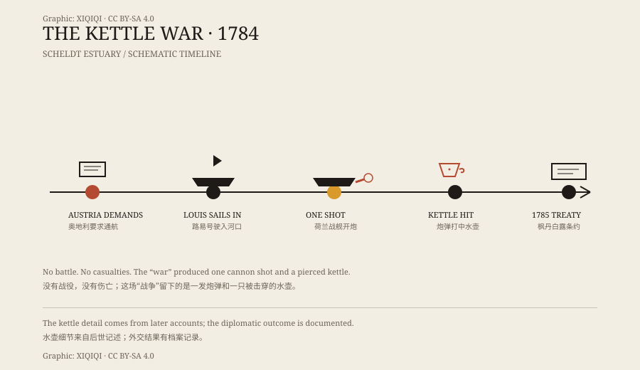

## 一、一条被锁住的河

斯海尔德河从法国北部流过比利时，最后在荷兰西南部入海。

河的入海口在荷兰手里。荷兰人靠着这条水道做生意，也靠着它收税。对上游的奥地利属地来说，这条河被锁住，货物就得绕路，成本高得多。

1784 年，奥地利皇帝约瑟夫二世决定试一试。他要求荷兰开放斯海尔德河的航运。

河口很宽，水是灰的。两岸低平，风车在远处转。商船和战舰都停在视线里，谁也没有先动。

荷兰拒绝了。

## 二、1784 年的船

奥地利方面派了一艘船，叫“路易号”，从安特卫普方向驶向河口。

这不是一支舰队，也不是一次大规模入侵。它更像一次试探：船开过去，看荷兰人会不会真的拦。

荷兰方面派出了战舰“海豚号”。两边在河口相遇。

*场景复原：1784 年斯海尔德河口的奥地利船与荷兰战舰。不是历史画作。稀奇奇编辑部，CC BY-SA 4.0。*

*原创示意图：1784 年斯海尔德河口事件的时间线与“一炮—水壶—条约”的经过。不是历史画作。稀奇奇编辑部，CC BY-SA 4.0。*

## 三、一炮

荷兰战舰开了一炮。

这一炮没有击沉路易号，也没有造成人员死亡。它打中了船上的一个水壶——至少，后来的故事是这么讲的。

水壶可能放在甲板上，也可能在厨房里。故事没有交代。它只是被记住了，因为它是这场冲突里唯一被打中的东西。

路易号随后降下旗帜，接受了检查。整场“战争”到此结束。

没有第二炮。双方都明白，这一炮是表态，不是开战。

## 四、水壶

“水壶战争”这个名字，就是从这里来的。

一个被炮弹打穿的水壶，成了这场冲突最著名的战利品。它听起来像个笑话，但在当时，这件事并不完全是笑话：它背后是河道控制权、贸易利益和国家面子。

只是冲突的规模，和“战争”这个词实在不匹配。没有军队推进，没有战役，没有伤亡名单。只有一炮，一个水壶，和一整套外交交涉。

## 五、条约

1785 年，双方签订《枫丹白露条约》。

奥地利放弃了对斯海尔德河自由通航的要求。荷兰则付出补偿，并对河道管理作出安排。对奥地利来说，这是一次没有拿到实质成果的试探；对荷兰来说，这是一次守住了河口的结果。

水壶战争没有改变欧洲的格局。它只是把一场大国之间的争执，压缩成了一发炮弹。

## 六、后来

这件事在后来的漫画、版画和通俗历史里反复出现。水壶成了一个方便的象征：一场看起来像战争、实际上只打了一炮的冲突。

它不适合放进军事史的重大战役章节，更适合放在“外交如何避免战争”的脚注里。两国都拿到了可以接受的结果，代价是一只水壶。

## 时间线

- **1784 年**：1784 年，奥地利皇帝约瑟夫二世决定试一试
- **1785 年**：1785 年，双方签订《枫丹白露条约》

## 来源与证据

本条目的事实底座以 1 条独立来源为主。S4（Rijksmuseum / Europeana）覆盖1784 年荷兰政治危机的讽刺版画，作为时代背景；不是凯特尔战争本身记录。
原创插图只提供场景复原、结构示意或地图，不作为历史照片使用。正文把可核对记录、后来解释与传说分开叙述；同一件事在不同来源中的版本差异，保留在行文中，不强行合并。

## 档案空白

案件或事件的官方记录、当事人证词与后来叙述之间，常有利害关系和记忆偏差；越著名的故事，越容易把后来添加的细节当成原始事实。
这条档案把记录与未答的问题并排放置，不替读者做出超出证据的结论。
就可信度而言，本条目标为“verified”。这个标签描述的是当前证据状态，不是对传说真伪的终审；新档案出现时，标签应随之调整。

## 档案补记

以下补记保留正文没有展开的档案侧面：来源、技术细节与后续影响。
**条约**。 1785 年，两国签了条约。

边界被划清，冲突结束。水壶成了象征：一场没有流血的战争。

1785 年的条约，划清了边界。

双方交换了土地，解决了争端。水壶战争，成了条约的注脚。

1785 年，两国签了条约。

边界被划清，冲突结束。
**边界**。 1784 年，荷兰共和国和奥地利属尼德兰，在边境上发生了一场冲突。

边界没有划清。两国在默兹河附近的一个小岛上，争夺主权。

1784 年的边界，没有划清。

荷兰和奥地利，都认为自己拥有默兹河附近的小岛。
**船**。 奥地利的一艘船，越过了荷兰的边界。

船上的人，带着武器，也带着一只水壶。荷兰方面开炮，炮弹打中了水壶。

奥地利的船，越过了边界。

船上的人，带着武器和水壶。他们想宣示主权。
**又记**。 水壶战争，是一场没有流血的战争。

它只开了一炮，打中了一只水壶。历史书记住了水壶，忘记了边界。

一只水壶，挡住了一场战争。这大概是历史上最便宜的外交胜利，也是最荒唐的边界冲突。故事没有死人，却留下了一个国家之间的线。

历史有时很轻，轻得像一只水壶；但它留下的边界，很重，重到两个国家都要画一条线。

一只水壶，换来一条边界。历史有时就这么轻。

---

**来源与许可**：本文的事实来源见条目底部来源台账 S1–S3。文字与原创示意图采用 CC BY-SA 4.0。文中把有记录的外交与军事经过，与“水壶”这一广为流传的细节分开叙述；水壶被击中的具体情形来自后世记述。
